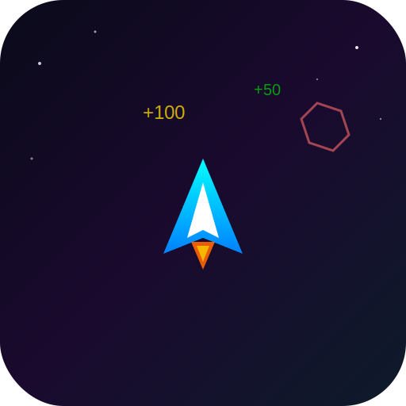

# Space Dodger

[](https://opensource.org/licenses/MIT)
[](https://astro.build)
[](https://learncard.com)

A visually stunning arcade-style space dodger game that issues verifiable credentials for high score achievements via the LearnCard Network.



## Features

- **Fast-Paced Arcade Action**: Dodge asteroids and collect power-ups in a neon-soaked space environment
- **Progressive Difficulty**: The game gets faster and more challenging as your score increases
- **Achievement Credentials**: Earn verifiable credentials for reaching score milestones:
  - **Bronze Space Pilot** (1,000 points)
  - **Silver Space Pilot** (5,000 points)
  - **Gold Space Pilot** (10,000 points)
  - **Platinum Space Ace** (25,000 points)
- **Visual Appeal**: Stunning neon aesthetics with particle effects, smooth animations, and responsive design
- **Cross-Platform**: Works on desktop (keyboard) and mobile (touch controls)
- **LearnCard Integration**: Seamless SSO and credential issuance via Partner Connect SDK

## Tech Stack

- **Framework**: [Astro](https://astro.build/) - Fast, modern static site generator
- **Styling**: Tailwind CSS + Custom Canvas animations
- **SDK**: [@learncard/partner-connect](https://www.npmjs.com/package/@learncard/partner-connect) - Secure cross-origin communication with LearnCard
- **Backend**: Astro Actions for achievement validation
- **Deployment**: Configured for Netlify

## Quick Start

### Prerequisites

- Node.js 18+ 
- pnpm (recommended) or npm

### Installation

1. Clone the repository:
   ```bash
   git clone https://github.com/learningeconomy/space-dodger.git
   cd space-dodger
   ```

2. Install dependencies:
   ```bash
   pnpm install
   ```

3. Set up environment variables:
   ```bash
   cp .env.example .env
   ```
   
   Edit `.env` to configure your template aliases (see [Configuration](#configuration) below).

4. Start the development server:
   ```bash
   pnpm dev
   ```

5. Open http://localhost:4321 in your browser

## Configuration

### Required Template Aliases

This app uses the **Partner Connect SDK template-based credential issuance** pattern. The following boost templates must be configured in your LearnCard app store listing:

| Template Alias | Achievement | Min Score |
|---------------|-------------|-----------|
| `space-dodger-bronze` | Bronze Space Pilot | 1,000 |
| `space-dodger-silver` | Silver Space Pilot | 5,000 |
| `space-dodger-gold` | Gold Space Pilot | 10,000 |
| `space-dodger-platinum` | Platinum Space Ace | 25,000 |

Configure these in your `.env` file:

```bash
LEARNCARD_TEMPLATE_BRONZE=space-dodger-bronze
LEARNCARD_TEMPLATE_SILVER=space-dodger-silver
LEARNCARD_TEMPLATE_GOLD=space-dodger-gold
LEARNCARD_TEMPLATE_PLATINUM=space-dodger-platinum
```

### Optional Configuration

```bash
# Override LearnCard host (for staging)
LEARNCARD_HOST_ORIGIN=https://staging.learncard.app
```

## Game Controls

### Desktop
- **Arrow Keys** or **WASD**: Move ship left/right
- **Up Arrow** or **W**: Activate boost
- **Space**: Pause/Resume

### Mobile
- **Touch Left/Right zones**: Move ship
- **Boost Button**: Activate boost
- **Pause Button**: Pause/Resume

## Architecture

### Template-Based Credential Issuance

Unlike traditional credential issuance that requires a backend issuer seed, Space Dodger uses the Partner Connect SDK's template-based approach:

1. Game validates achievements on the backend (score/tier verification)
2. Credentials are issued directly from the user's wallet using pre-configured boost templates
3. Template aliases map to boosts configured in the app store listing

### Security

- No private keys stored in the browser
- All credential operations go through the secure Partner Connect SDK
- Backend only validates achievement eligibility, never issues credentials directly

## Deployment

### Netlify

This app is pre-configured for Netlify deployment:

1. Connect your repository to Netlify
2. Set the build command: `pnpm build`
3. Set the publish directory: `dist`
4. Configure environment variables (template aliases) in Netlify dashboard

### Environment Variables for Production

Make sure to set these in your deployment platform:

- `LEARNCARD_TEMPLATE_BRONZE`
- `LEARNCARD_TEMPLATE_SILVER`
- `LEARNCARD_TEMPLATE_GOLD`
- `LEARNCARD_TEMPLATE_PLATINUM`

## App Store Setup

To enable credential issuance in production:

1. Create an app store listing for Space Dodger on [LearnCard Developer Portal](https://developer.learncard.com)
2. Create boost templates for each achievement tier
3. Associate the boosts with template aliases
4. Update your deployment environment variables with the actual template aliases
5. Set up a signing authority for the app
6. Publish to the app store

## Troubleshooting

### "Boost not found for this app" Error

The template aliases in your environment variables don't match the aliases configured in your app store listing. Check the actual aliases in the LearnCard Developer Portal and update your environment variables accordingly.

### Authentication Issues

- Ensure you're logged into the LearnCard app
- Check that the `LEARNCARD_HOST_ORIGIN` matches your environment (production vs staging)
- Verify your app store listing is properly configured

## Contributing

Contributions are welcome! Please feel free to submit a Pull Request. For major changes, please open an issue first to discuss what you would like to change.

## License

This project is licensed under the MIT License - see the [LICENSE](LICENSE) file for details.

## Acknowledgments

- Built by the [Learning Economy Foundation](https://learningeconomy.io)
- Powered by the [LearnCard Network](https://learncard.com)
- Originally created as part of the [LearnCard Example Apps](https://github.com/learningeconomy/LearnCard) collection

## Support

- Documentation: [docs.learncard.com](https://docs.learncard.com)
- Issues: [GitHub Issues](https://github.com/learningeconomy/space-dodger/issues)
- Email: support@learncard.com
